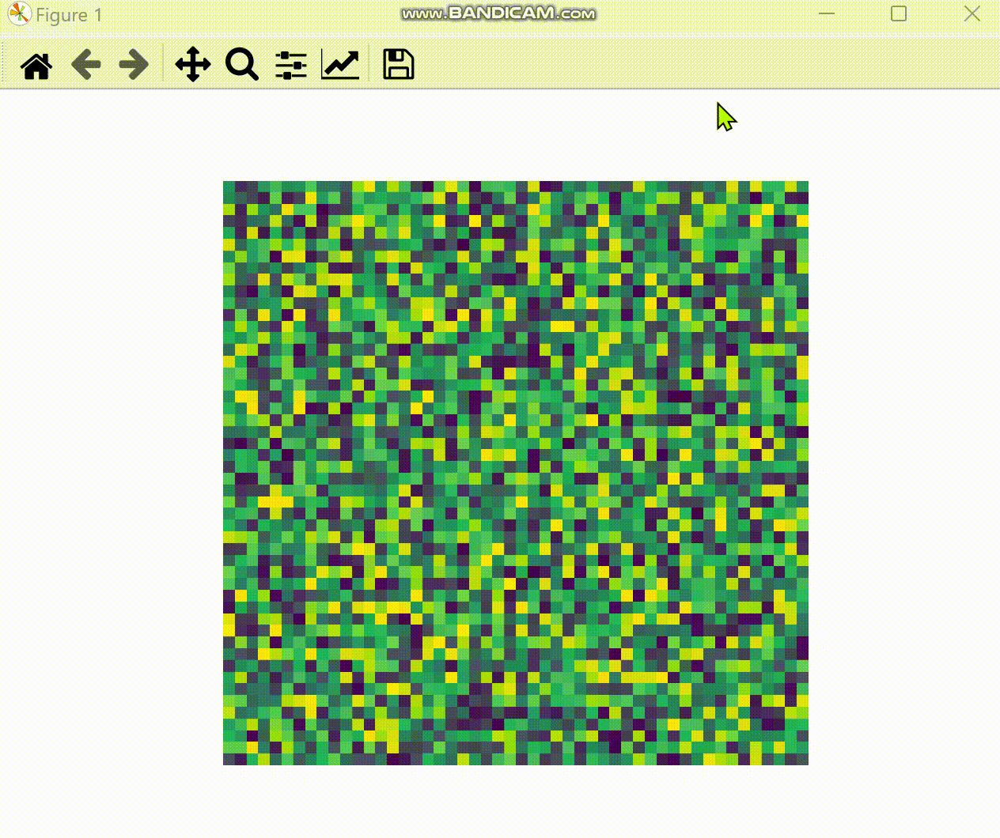
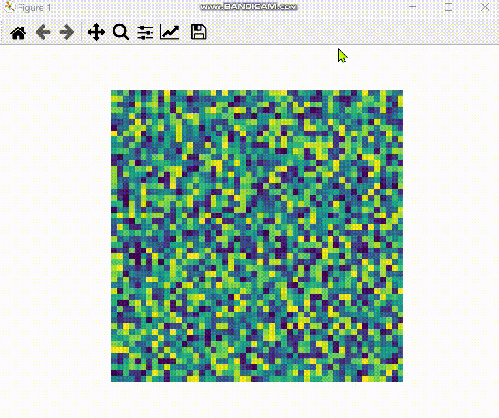
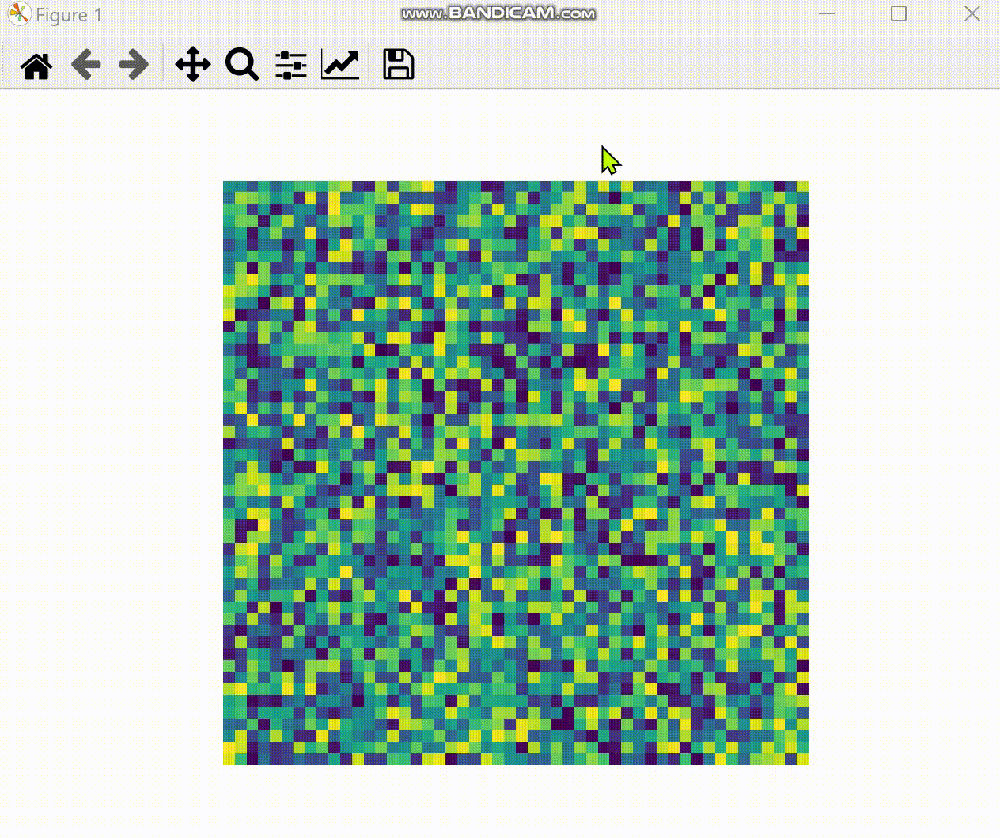

Здесь находится абстрактный класс содержащий все основные свойства и методы позволяющие анимировать фигуры из классов потомков. 

Абстрактный класс реализует "подключение" к уже существующим осям (matplotlib.pyplot.Axes) с наложенным изображением с целью добавления интерактивных взаимодействий с ними (рисование фигур поверх уже существующего изображения, извлечение данных внутри фигур и т.д).

Здесь также находятся "элементарные" классы, описывающие фигуры которые должны быть добавлены и анимированы, а также их основной функционал. 

Пакеты верхнего уровня реализуют расширения данных "элементарных" фигур.

На данный момент реализованы 3 элементарных типа: точки, линии и прямоугольники:

