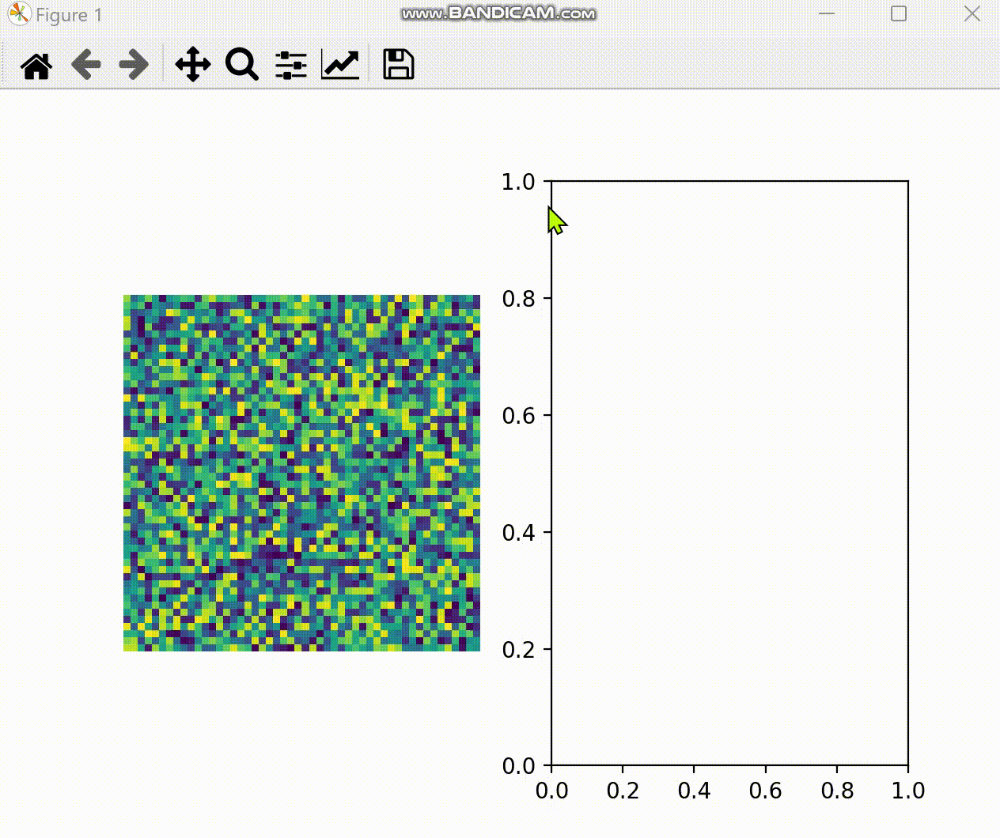

На данном уровне реализованы расширения "элементарных" классов. Помимо подключения к уже существуюшим осям для каждого расширения реализовано создание "выходных" осей (либо подключение к ним) и анимированное отображение на них данных, полученных путем взаимодействия фигур с входными осями. 

На данный момент реализованы классы:
1. Lumen: подключается к 3-х мерным данным и добавляет возможность точке получать информацию всех слоев в выбранном пикселе и отображать ее в выходных осях

2. Slice: позволяет получать данные под линией и визуализировать их в выходных осях

3. ROI: позволяет отобразить в выходных осях данные изображения под прямоугольником

4. 
