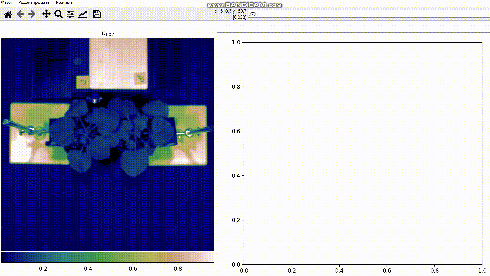

# Пользовательский интерфейс для обработки HSI (гиперспектральных изображений) в области биологических исследований

Ссылка на тестовые данные: https://disk.yandex.ru/d/lyLBskE5of0kfA

Разрабатываемое приложение представляет собой интерфейс позволяющий исследователю находить закономерности в гиперспектральных данных и использовать полученные результаты в научных статьях. ПО тестируется на многомерных изображениях растений и используется с целью выявления их болезней на ранней (досимптомной) стадии. На данный момент разработан следующий функционал:

1. "Умное" текстовое поле позволяющее анализировать введенные формулы и визуализировать как отдельный канал HSI, так и произвольный спектральный индекс (математика нескольких каналов). Также способно отделять объект (напр. растение) от фона по пользовательскому спектральному индексу и произвольному численному порогу. Полученный результат отображается в виде тепловой карты одноканального результирующего изображения канала (индекса) и может быть использован для последующих взаимодействий. Заголовок полученной тепловой карты отображает введенную формулу в стиле latex, где номера каналов заменяются соответствующими им длинами волн (в нанометрах).

2. Визуализация полученного канала (индекса) в интерактивном трехмерном виде; визуализация псевдо-RGB исходного гиперспектрального изображения.

3. Возможность изменять исходные HSI данные путем сглаживания его спектральных сигнатур фильтром Савицкого-Голея для уменьшения шума в кубе данных.
4. Возможность сохранять результаты канала (индекса) или любого из режимов в виде xlsx таблиц.
8. Реализованы несколько режимов позволяющих исследователю интерактивно взаимодействовать либо с HSI. либо с результирующим каналом (индексом):

  а) Режим спектрального просвета: "просвечивает" куб данных HSI в выбранном пикселе позволяя отобразить его спектральную сигнатуру на графике
  

  б) Режим среднего спектра: реализовывает функционал нахождения усредненной спектральной сигнатуры по выбранной области интереса (ROI), а также нахождения так называемой "средней матрицы" по этой сигнатуре. Средняя матрица содержит в себе нормализованные разницы всех пар значений среднего спектра и визуализирована в виде тепловой карты.

  в) Режим среза данных: также позволяет интерактивно отмечать ROI на канале (индексе), но помимо этого реализовывает функционал интерактивного нахождения вертикального среза данных с помощью движений мыши или текстового поля. Значения ROI находящиеся под выбранными координатами отображаются на графике. 

